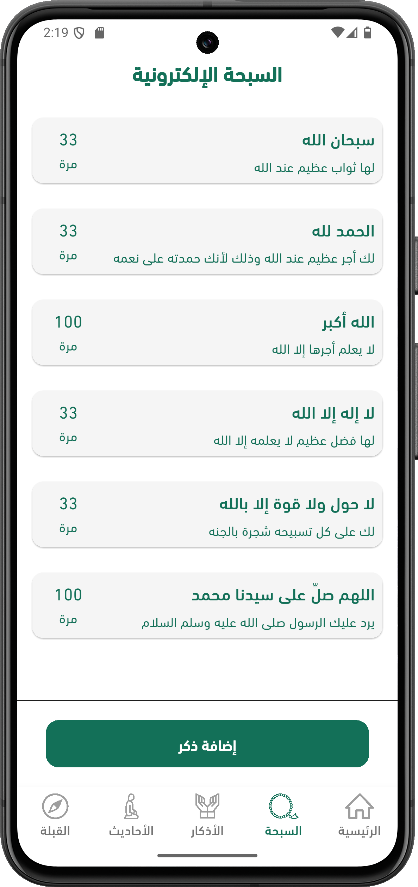

# Serat

<p align="center">
  
</p>

<p align="center">
  <strong>A comprehensive Islamic app designed to assist Muslims in their daily worship and spiritual journey.</strong>
  <br />
  <br />
  
  
  
</p>

---

## 📸 Screenshots

| Screenshot | Screenshot | Screenshot |
|:---:|:---:|:---:|
| <br/>Home | <br/>Prayer Times | <br/>Quran |
| <br/>Hadith | <br/>Azkar | <br/>Sebha |
| <br/>Screenshot 7 | <br/>Screenshot 8 | <br/>Screenshot 9 |
| <br/>Screenshot 10 | <br/>Screenshot 11 | <br/>Screenshot 12 |
| <br/>Screenshot 13 | <br/>Screenshot 14 | <br/>Screenshot 15 |
| <br/>Screenshot 16 | <br/>Screenshot 17 | <br/>Screenshot 18 |
| <br/>Screenshot 19 | <br/>Screenshot 20 | <br/>Screenshot 21 |
| <br/>Screenshot 22 | <br/>Screenshot 23 | <br/>Screenshot 24 |
| <br/>Screenshot 25 | <br/>Screenshot 26 |  |

## ✨ Features

-   **Prayer Times & Qibla Direction:** Accurate prayer times with customizable alarms and a compass-based Qibla finder.
-   **Full Quran:** Read the complete Holy Quran with a Mushaf-like interface, audio recitations from various Qaris, and verse/page bookmarking.
-   **Tafsir (Interpretation):** Access detailed interpretations for deeper understanding of Quranic verses.
-   **Extensive Hadith Collection:** Browse and search major Hadith books, including a dedicated section for Imam al-Nawawi's Forty Hadith.
-   **Daily Azkar & Digital Tasbih:** Categorized morning, evening, and post-prayer supplications with counters, and a digital Tasbih with haptic feedback.
-   **Islamic Quiz:** Test and expand your knowledge on various Islamic topics.
-   **Quran Videos & Islamic Radio:** Watch curated Quran-related videos and stream live Islamic radio channels.
-   **Hijri Calendar:** View the Islamic calendar, track important dates, and see upcoming holidays.
-   **Daily Goal Tracking:** Set, track, and achieve personal daily worship goals.
-   **Light & Dark Mode:** Beautifully designed interface supporting both light and dark themes.
-   **Onboarding Experience:** A guided tour to introduce new users to all app features.
-   **Multilingual Support:** The app is available in multiple languages to serve a global audience.

## 🛠 Tech Stack

- **Framework**: Flutter
- **State Management**: BLoC
- **Dependency Injection**: GetIt & Injectable
- **Networking**: Dio
- **Local Storage**: Shared Preferences & Secure Storage
- **Audio/Video**: `just_audio`, `audio_service`, `video_player`
- **Location**: Geolocator & Flutter Compass
- **Notifications**: Flutter Local Notifications
- **Database**: (Likely using local JSON files)

## ⚙️ Development Requirements

- Flutter SDK >= 3.2.3
- Dart SDK >= 3.0.0
- Android Studio / VS Code
- Git

## 🚀 Getting Started

1.  **Clone the repository:**
    ```bash
    git clone https://github.com/hamdyhaggag/serat.git
    cd serat
    ```

2.  **Install dependencies:**
    ```bash
    flutter pub get
    ```

3.  **Set up YouTube API Key:**
    - Obtain an API key from [Google Cloud Console](https://console.cloud.google.com).
    - Enable the "YouTube Data API v3" for your project.
    - Add the key to your environment variables. Replace `your_api_key_here` with your actual key:

    ```bash
    # For Linux/macOS
    export YOUTUBE_API_KEY=your_api_key_here

    # For Windows (PowerShell)
    $env:YOUTUBE_API_KEY="your_api_key_here"
    ```

4.  **Run the app:**
    ```bash
    flutter run
    ```

## 🔒 Security and Privacy

- All user data is stored locally on the user's device.
- No personal data is collected by the application.
- HTTPS is utilized for all network communications to ensure data security.
- Users have the ability to delete their data at any time.

## 🤝 Contributing

Contributions are welcome! Please follow these steps:

1.  Fork the project.
2.  Create a new feature branch (`git checkout -b feature/AmazingFeature`).
3.  Commit your changes (`git commit -m 'Add some AmazingFeature'`).
4.  Push to the branch (`git push origin feature/AmazingFeature`).
5.  Open a Pull Request.

## 📄 License

This project is licensed under the MIT License. See the `LICENSE` file for details.
*(Note: If you don't have a `LICENSE` file in your project, you should add one to match this section.)*

## 📧 Contact

- Email: arabianatech@gmail.com
- App Page: [Google Play Store](https://play.google.com/store/apps/details?id=com.serat.app)